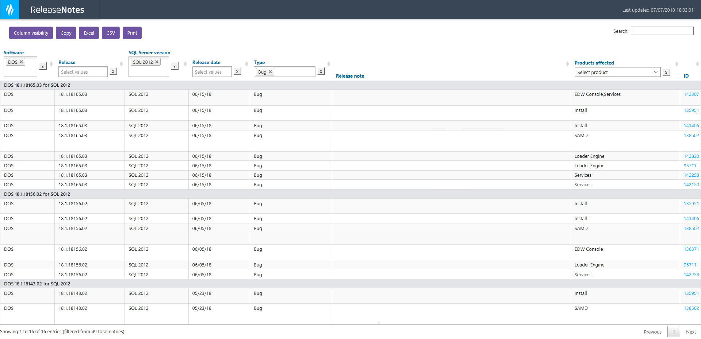

A long list of release notes covering multiple products and services, versions, supported SQL Server versions, etc., makes it difficult to discover information relevant to a specific combination of those categories. This solution automatically generates release notes from VSTS work items associated with a VSTS release and publishes them in a filterable, sortable, and searchable HTML table.



For less-complex needs, consider using the VSTS release notes extension [described below](#step-2-set-up-a-release-notes-task) and forgetting the rest.

> #### Difference between this solution and the [vsts-to-release-notes-from-query](https://github.com/HealthCatalyst/vsts-release-notes-from-query) Health Catalyst project
> This solution generates release notes from work items associated with a VSTS release. The other solution generates them from VSTS queries.

# How this project works
Release notes include what changed, which product version the change was released with, and when it was released. Default and custom fields in VSTS work items can contain that information, and the VSTS release pipeline can group work items by release. This project extracts that information and uses it to generate release notes.

# Step 1: Identify default and custom fields in VSTS work item forms. Create custom fields if necessary.
Within the CAP VSTS project, release note information is pulled from the following fields. These fields may not be available in other Health Catalyst VSTS projects. If you're working in another project, you can either rely wholly on default fields or create custom fields on your project's work-item forms.

> [Where to manage custom fields and modify your project's work-item forms](https://healthcatalyst.visualstudio.com/DefaultCollection/_settings/process?_a=all)

### Default fields in the CAP VSTS project
Field | Description | Field name stored in VSTS
-|-|-
ID | Work item ID | `System.id`
State | This project recognizes only items in a `Done` state | `System.State`
Work item type | Epic, Feature, Product Backlog Item, Bug | `System.WorkItemType`

### Custom fields in the CAP VSTS project
Within the CAP VSTS project, the following fields are grouped on a custom **RN** tab on the Feature, Product Backlog item, and Bug work item forms.

Field | Description | Field type | Field name stored in VSTS
-|-|-|-
Product(s) affected | CAP product(s) or service(s) a change affects | Multi-select picklist | `Platform.ProductsAffected`
Version(s) affected | CAP version(s) a change affects | Multi-select picklist | `Platform.VersionsAffected`
Release note | The release note | Open-entry HTML field | `Platform.ReleaseNote`
Publish | Whether the work item should be published as a release note | Boolean | `Platform.Publish` 

# Step 2: Set up a release notes task.
The [Generate release notes task](https://marketplace.visualstudio.com/items?itemName=richardfennellBM.BM-VSTS-GenerateReleaseNotes-Task) (already installed in Health Catalyst's VSTS instance) gathers work items associated with a VSTS release. It extracts content from the work-item fields you select, places it in a customizable template, and outputs a Markdown file.

## Steps
- Create a VSTS release.
- Add the release notes task.
- Add a template in the release notes task's template configuration field.

### How to define a template
Each work-item field has an identifier in the VSTS backend. These are used in the template. If you're not working in the CAP VSTS project, you may need to modify [this project's template](#json-template) to replace the CAP-specific backend names (they begin with `Platform`) with the backend names of any custom field names you created in Step 1. Find the backend names in the following link:

> [Default and custom work-item fields in Health Catalyst's VSTS instance](https://healthcatalyst.visualstudio.com/DefaultCollection/35d4f7da-bff2-40f0-b1f7-3445e5bb03ce/_apis/wit/fields)
>
> [Sample templates](https://github.com/rfennell/vNextBuild/tree/master/SampleTemplates/GenerateReleaseNotes%20(Original%20Powershell%20based))

### JSON template
This project modifies the template to print JSON objects instead of Markdown. This prepares the release notes to be molded into a dynamic HTML table.

```
@@WILOOP@@
{"id": "$($widetail.id)","state": "$($widetail.fields.'System.State')","type": "$($widetail.fields.'System.WorkItemType')","releaseNote": "$($widetail.fields.'Platform.ReleaseNote')","versionsAffected": "$($widetail.fields.'Platform.VersionsAffected')","productsAffected": "$($widetail.fields.'Platform.ProductsAffected')","publish": "$($widetail.fields.'Platform.Publish')","releaseName": "{$($release.name)","releaseDate": "$("{0:dd/MM/yy HH:mm:ss}")"}
@@WILOOP@@
```
Note that:
- Even though the VSTS backend styles the work item ID as `System.Id`, only `.id` is used in the template definition.
- `($release.name)` is a custom VSTS release variable -- in this case, it is the name given to an ongoing release (e.g., `DOS 18.1 for SQL Server 2012`).

Sample output:

```
{
    "id": "139731",
    "state": "Done",
    "type": "Product Backlog Item",
    "releaseNote": "Redacted",
    "versionsAffected": "18.1",
    "productsAffected": "EDW Console;Install",
    "publish": "Yes",
    "releaseName": "DOS 18.1.18143.02 for SQL 2012 triggered on 052318-170451",
    "releaseDate": "05/23/18 23:04:51"
}
{
    "id": "135951",
    "state": "Done",
    "type": "Bug",
    "releaseNote": "Redacted",
    "versionsAffected": "18.1;4.0;4.2",
    "productsAffected": "SAMD;SMD",
    "publish": "No",
    "releaseName": "DOS 18.1.18143.02 for SQL 2016 triggered on 052318-170451",
    "releaseDate": "06/15/18 23:04:51"
}
...
```

Note that:
- No method has been discovered to generate valid JSON from the looping template.
- The Bash script in this project turns the output into valid JSON.

# Step 3: Add execution of the script in the VSTS release pipeline.
## Steps
- Add execution of the script to the VSTS release.
- Add the [requirements](#required-on-the-build-or-release-server) on the build server.
- [Automate publication](#ways-to-automate-publication).
- [Test locally](#one-way-to-test-locally) as needed.

### How the script modifies the JSON output
The Bash script primarily uses [jq](https://stedolan.github.io/jq), a command-line JSON processor, to form valid JSON, exclude work items where `Publish` does not equal `Yes`, define a change as a **Fixed bug** or **Added functionality**, create or combine select fields, etc. Each step is documented in the Bash script.

Sample output:

```
[
  {
    "releaseDate": "05/23/18",
    "fullName": "DOS 18.1.18143.02 for SQL 2012",
    "sqlServerVersion": "SQL 2012",
    "software": "DOS",
    "releaseName": "18.1.18165.03",
    "releaseNote": "Redacted",
    "type": "Product Backlog Item",
    "productsAffected": [
      "EDW Console",
      "Install"
    ],
    "id": "139731",
    "Type": "Added functionality"
  },
  {
    "releaseDate": "06/15/18",
    "fullName": "DOS 18.1.18143.02 for SQL 2012",
    "sqlServerVersion": "SQL 2016",
    "software": "DOS",
    "releaseName": "18.1.18165.03",
    "releaseNote": "Redacted",
    "type": "Bug",
    "productsAffected": [
      "SAMD",
      "SMD"
    ],
    "id": "135951",
    "Type": "Patched bug"
  },
  ...
  ```

  Note that:
  - Not all fields in the "before" JSON are present in the "after" JSON. For example, the `Publish` field is needed in the "before" JSON to filter items labeled `No`, but it isn't needed in the "after" JSON because it doesn't need to be printed in the release notes.
  - Order doesn't matter. Column ordering happens in the JSON > HTML transformation step.

  ### How the script transforms JSON to an HTML table
A `getJSON` Javascript command turns the JSON file into an HTML table. JQuery, [Datatables](https://datatables.net/examples/index), [yadcf](http://yadcf-showcase.appspot.com), [select2](https://select2.org) and [chosen](https://harvesthq.github.io/chosen) apply search, filter, and sort.

### Required on the build or release server
- Bash (with sed)
- [dos2unix](https://www.npmjs.com/package/dos2unix)
- [jq](https://stedolan.github.io/jq)

### Ways to automate publication
#### Azure web app
- Manage code in VSTS.
- Use the `web.config` included in this project.
- Add a release task to publish to the Azure web app when updated code is merged.

#### Include in DocFx docs site
Assuming an automated release pipeline for a documentation site already exists:
- Add a new folder under `articles`.
- Place the .html, .json, and .css files inside.
- Add references to the folder in `docfx.json`:

```
...
"resource": [
      {
        "files": [
          "articles/release-notes/**",
...
```
- Add a reference in the `toc.yml` at root.

## One way to test locally
A server is required to test sort, filter, and search functionality in The HTML file. Following is an easy way to test:

- Install Node.js.
- Install [http-server](https://www.npmjs.com/package/http-server) with `npm install -g http-server`.
- Navigate to the directory with the JSON and HTML files.
- Start the http server with `http-server -c-1`.
- Go to [http://localhost:8080](http://localhost:8080).

# Troubleshoot
### HTML column filters not working
- Verify JQuery is loading only once.
- Verify JQuery comes first in the order of the scripts in `<head>` and `yadcf` comes last.

### Filters for `Product(s) affected` aren't working
Make sure JSON is formatted like this:
```
    "productsAffected": [
      "Loader Engine",
      "Services"
    ],
```

instead of this:
```
"productsAffected": "Loader Engine;Services",
```
The Bash script automatically takes care of this.

# How to
### Limit selectors in a dropdown
```
{
column_number: 7,
column_data_type: "html",
html_data_type: "selector",
filter_default_label: "Select tag",
data: ['one', 'two', 'three']
}
```
